In this report we present side by side the comparison of the three CPU balance strategies for Crimson using
Bluestore as backend.

Notice that there does not seem to be a clear advantage of one strategy over the other.

# 4k randread
## 8 OSD crimson, 5 vs 6 reactor, fixed FIO 8 cores, response latency
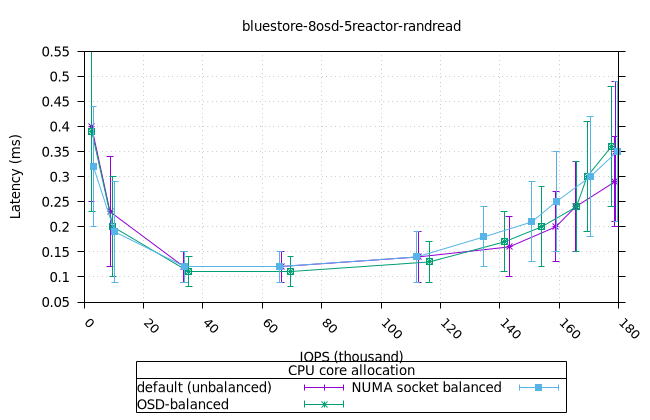
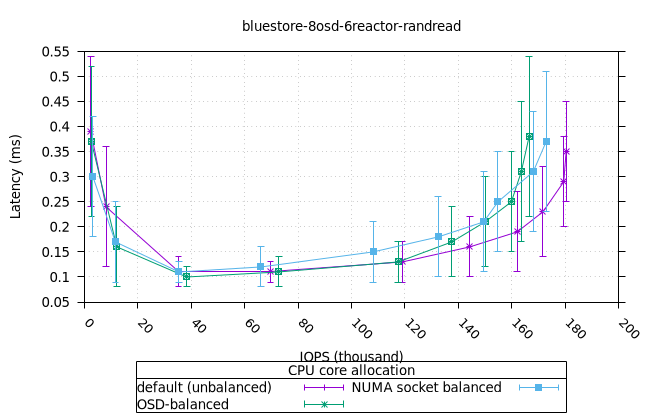

### OSD utilisation
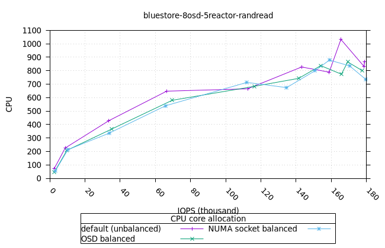

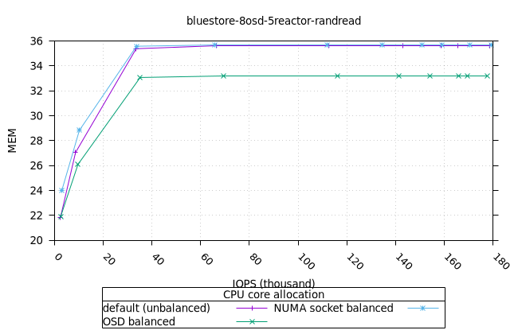
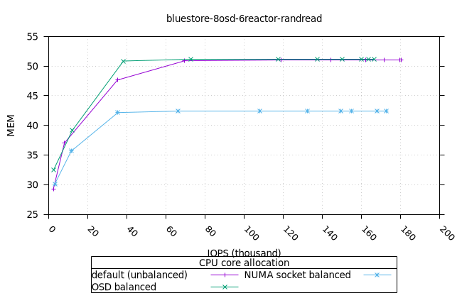
### FIO utilisation
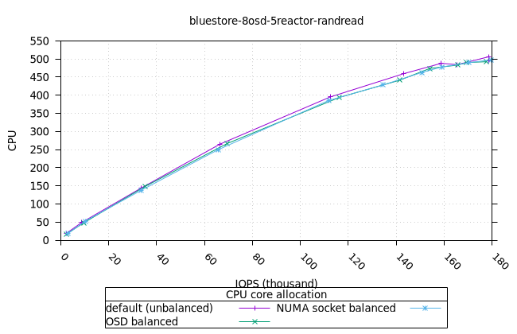
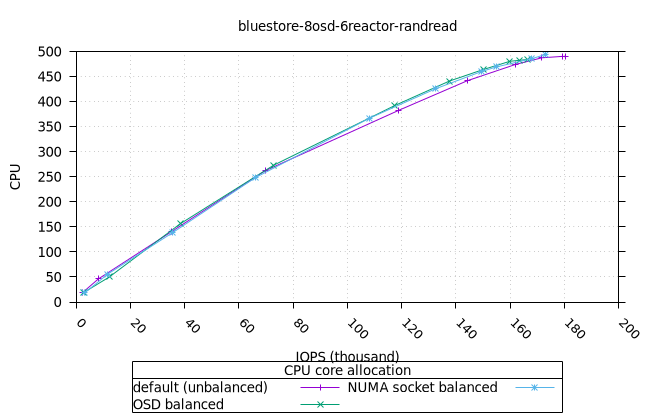
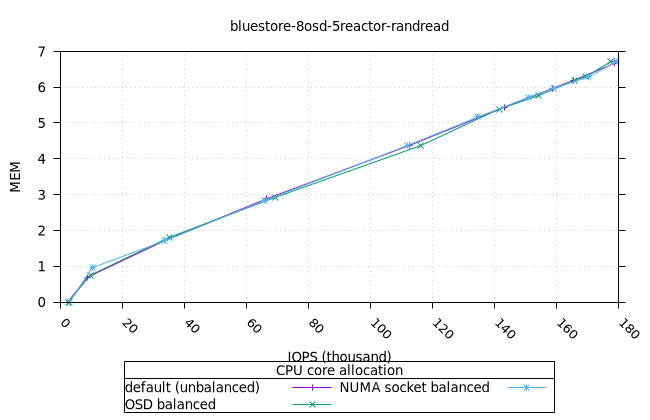
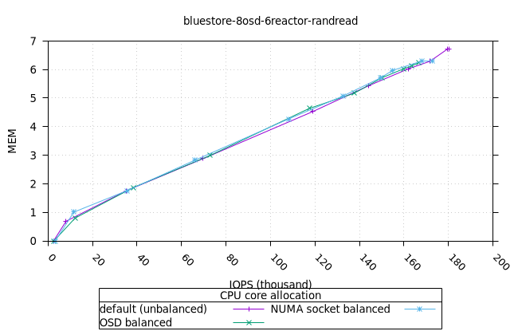
-
---
# 4k randwrite
It is interesting to note that the default configuration shows better performance for both five and six reactors, however
the NUMA socket and the OSD-balanced strategies perform worse on six reactors than five.

## 8 OSD crimson, 5 vs 6 reactor, fixed FIO 8 cores, response latency
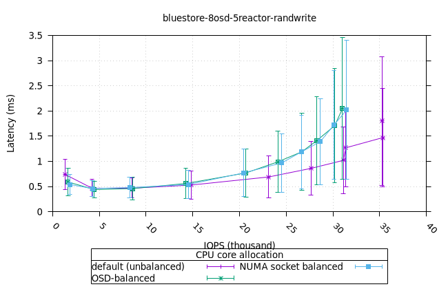

### OSD utilisation
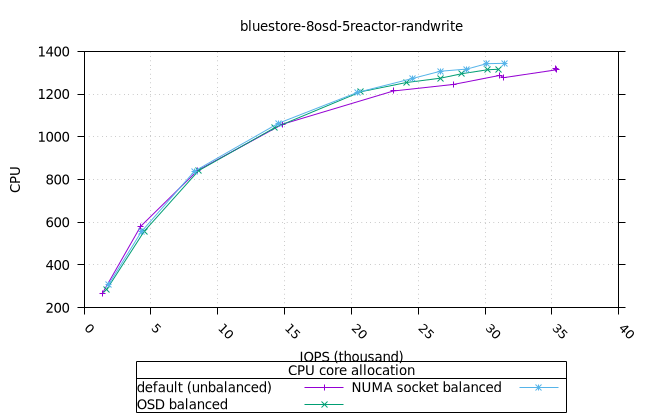

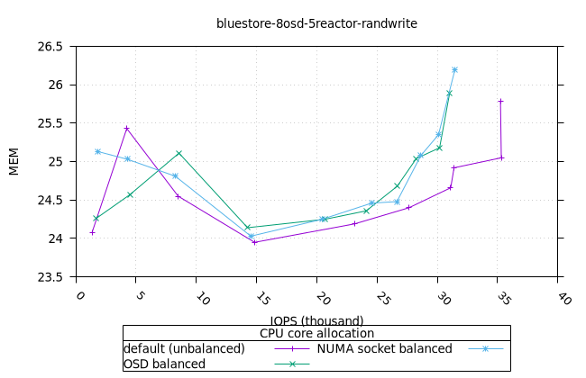
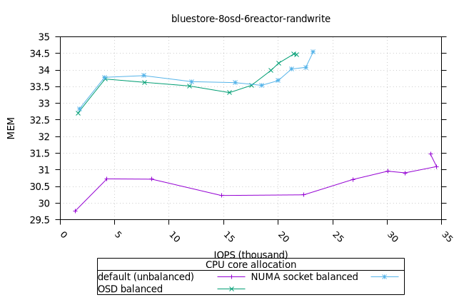
### FIO utilisation
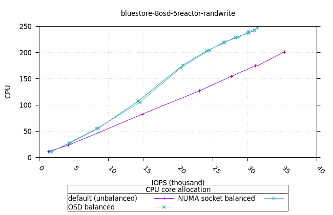
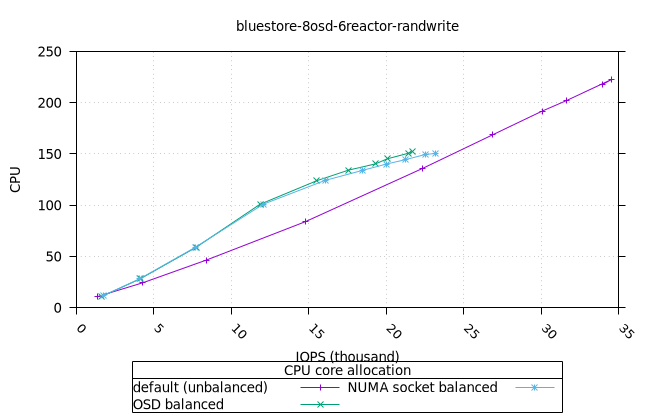
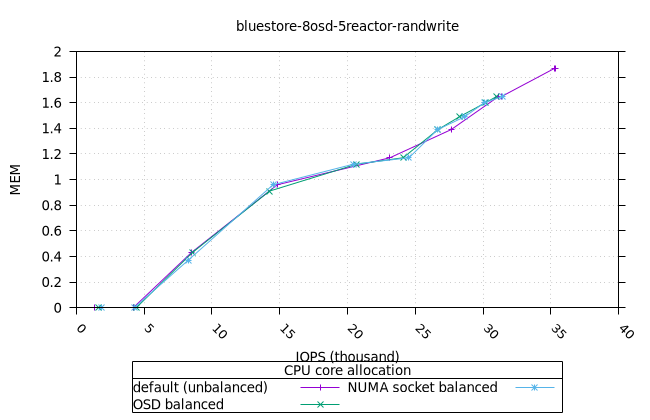
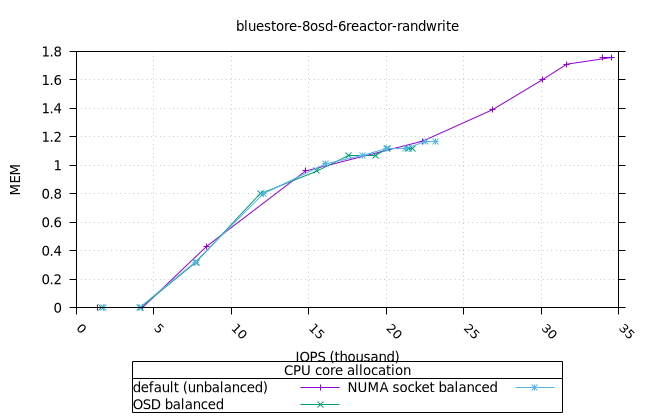
---
# 64k seqwrite
For this workload, both NUMA socket and OSD-balanced strategies perform marginally better than the default CPU allocation.

## 8 OSD crimson, 5 vs 6 reactor, fixed FIO 8 cores, response latency
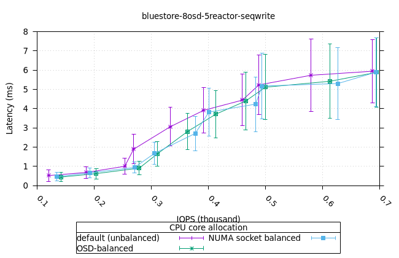

### OSD utilisation
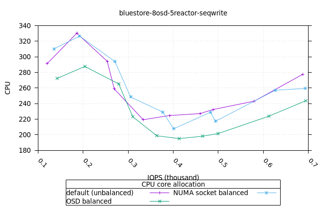
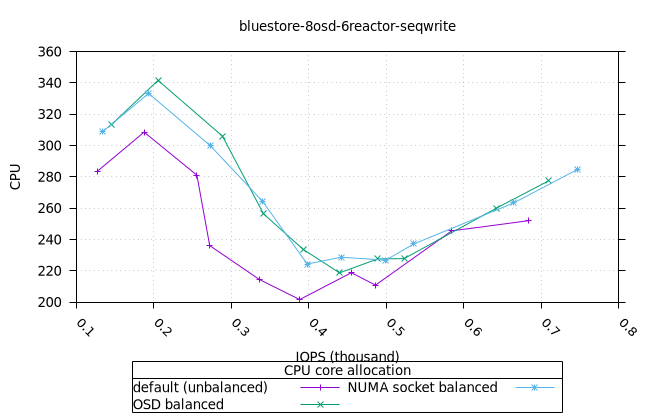
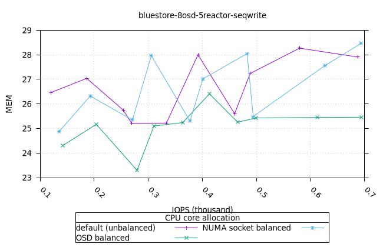
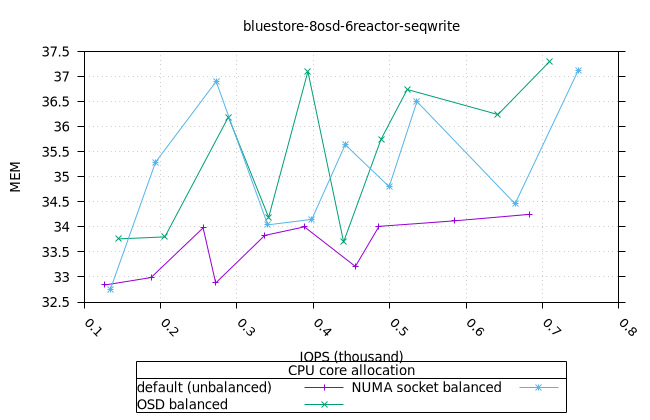
### FIO utilisation
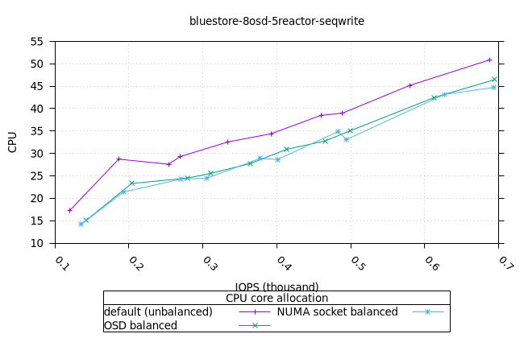
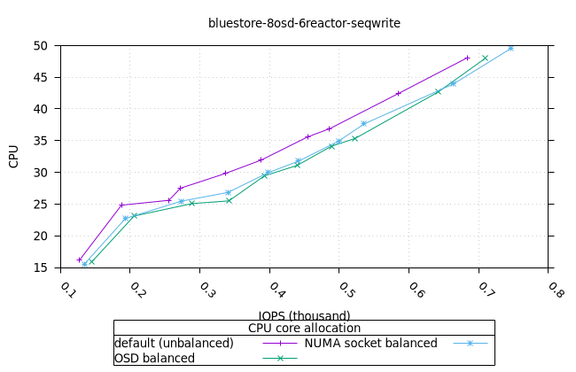
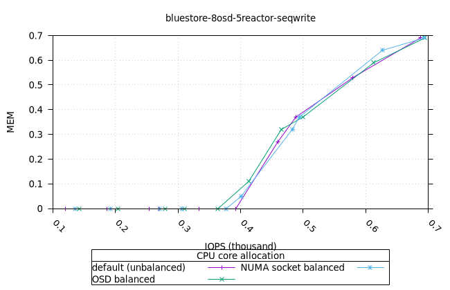

---
# 64k seqread
## 8 OSD crimson, 5 vs 6 reactor, fixed FIO 8 cores, response latency
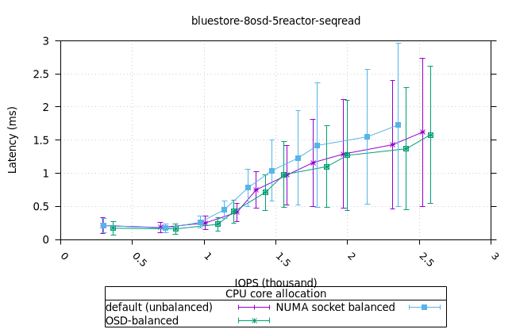
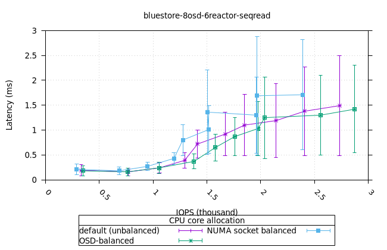

### OSD utilisation
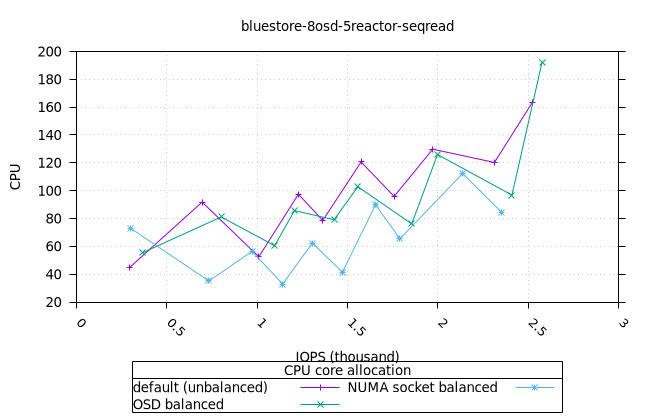
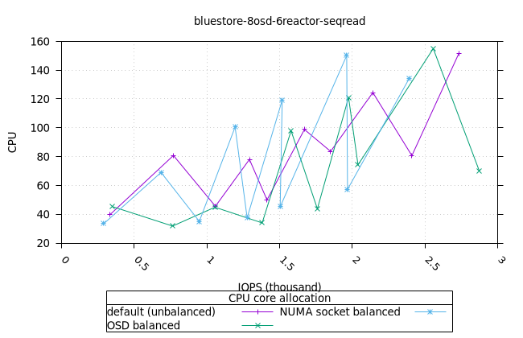
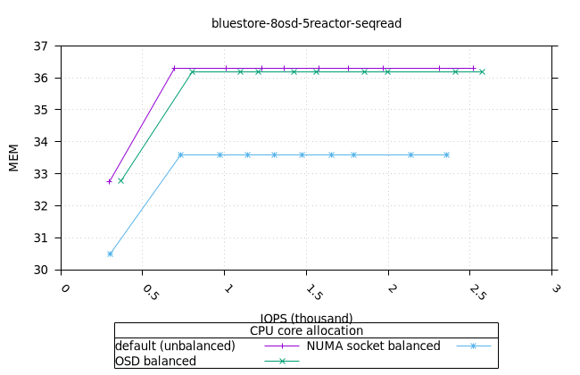
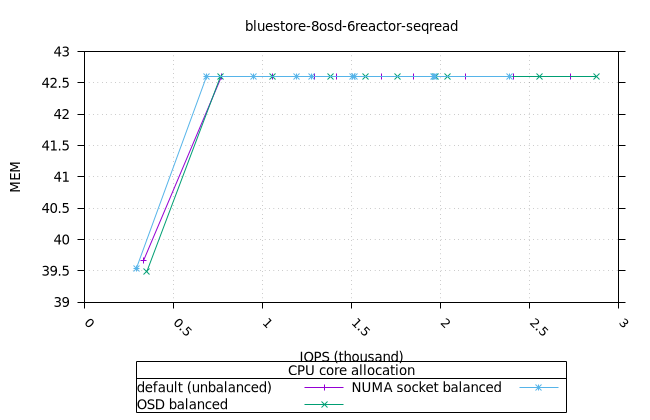
### FIO utilisation
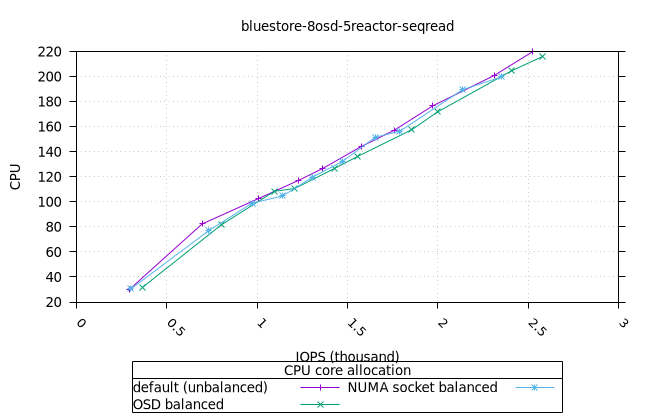
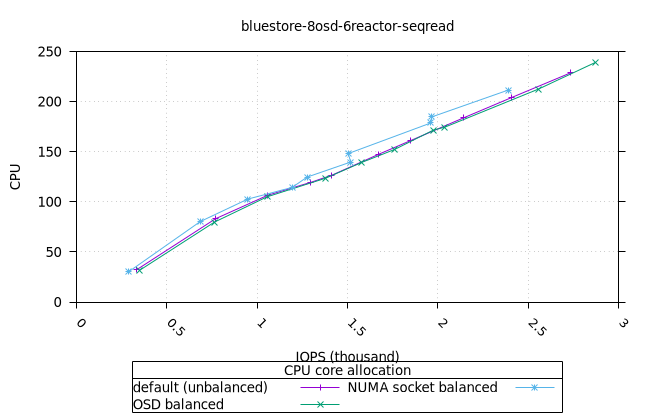
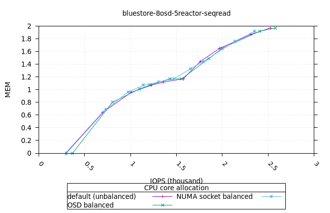
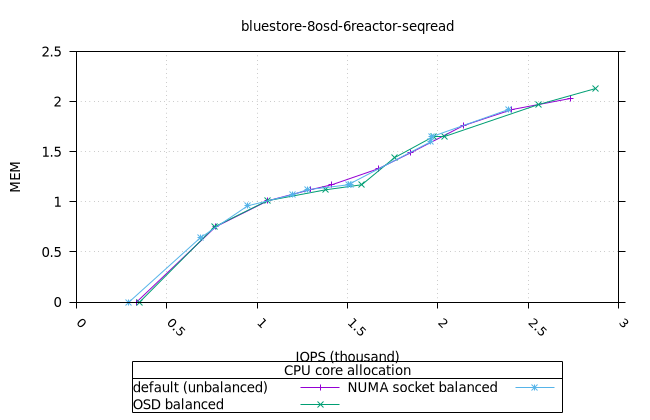
---
