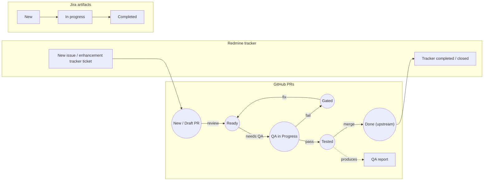

# Crimson Workload Flow

This document describes a simplified view of the Crimson workload flow spanning three related artifact tracks:

- Redmine tracker
- GitHub pull requests
- Jira artifacts

The diagram below is written in Mermaid so it can be rendered by platforms that support Mermaid in Markdown, including GitHub and compatible wiki/rendering environments.

## Workflow Diagram

## Flow Description

### 1. Redmine tracker
The Redmine tracker row starts with a single state:

- **New issue / enhancement tracker ticket**

and ends with:

- **Tracker completed / closed**

This represents the lifecycle of the top-level tracker item. Normally a tracker ticket is created first, and it may spawn one or more GitHub PRs. Once the PRs are merged and the work is complete, the tracker ticket is closed automatically.

### 2. GitHub PR lifecycle
The GitHub PR row models the main engineering workflow:

- A PR starts in **New / Draft PR**
- It can be created as a result of a tracker ticket, but it may also be created independently
- From **New / Draft PR**, a transition labelled **review** moves it to **Ready**
- From **Ready**, a transition labelled **needs QA** moves it to **QA in Progress**
- From **QA in Progress**: this is a subworkflow that results in a decision point with two possible outcomes:
  - **fail** leads to **Gated**
  - **pass** leads to **Tested**
- A successful QA pass also produces a separate event artifact:
  - **QA report**
- From **Gated**, a transition labelled **fix** returns the PR to **Ready**
- From **Tested**, a transition labelled **merge** moves it to **Done (upstream)**
- Once the PR is **Done (upstream)**, it connects back to the Redmine tracker completion state

### 3. Positive Jira artifacts (non-technical debt)
The Jira artifacts for non-technical debt considered are: Epics, User stories, and Tasks. 

- An Epic is a set of user stories, organised to produce a major piece of work.
- A User story is a child of an Epic, and may have one or more Tasks
associated with it. A User story captures the tuple: Who (User, developer, etc), What the user needs, and the Value
produced by this piece of work. It requires an Acceptance criteria to validate when the story has
been completed, normally when all its associated tasks have been completed.
- A Task is a unit of work that is typically assigned to a single engineer. It is the smallest unit of work in the Jira artifact hierarchy. Normally involve coding task, testing task, or documentation.

In the diagram above the Jira row is a simple left-to-right progression:

- **New**
- **In progress**
- **Completed**

This row is intentionally lightweight and shown as a simple artifact progression.

Note that for technical debt artifacts, under this simplified view, they require a tracker ticket to be created first, and then a PR is created to address the technical debt. Once the PR is merged, the tracker ticket is closed.

## Notes

- The simplest approach is that the workflow is guided by the Redmine tracker, which is the top-level artifact (and both positive and technical debt items). The PRs and Jira artifacts are created as needed to support the work.
- Circular nodes are used for GitHub PR states.
- The **QA report** is shown as a rectangular node to distinguish it from state nodes.
- The diagram is kept in standard Mermaid `flowchart` syntax for broad Markdown renderer compatibility.
