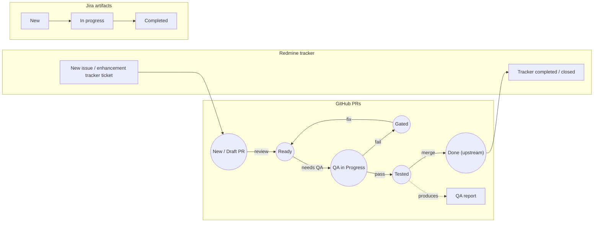

# Crimson Workload Flow

This document describes a Crimson workload flow spanning three related artifact tracks:

- Redmine tracker
- GitHub pull requests
- Jira artifacts

The diagram below is written in Mermaid so it can be rendered by platforms that support Mermaid in Markdown, including GitHub and compatible wiki/rendering environments.

## Workflow Diagram

## Flow Description

### 1. Redmine tracker
The Redmine tracker row starts with a single state:

- **New issue / enhancement tracker ticket**

and ends with:

- **Tracker completed / closed**

This represents the lifecycle of the top-level tracker item.

### 2. GitHub PR lifecycle
The GitHub PR row models the main engineering workflow:

- A PR starts in **New / Draft PR**
- It can be created as a result of a tracker ticket, but it may also be created independently
- From **New / Draft PR**, a transition labelled **review** moves it to **Ready**
- From **Ready**, a transition labelled **needs QA** moves it to **QA in Progress**
- From **QA in Progress**:
  - **fail** leads to **Gated**
  - **pass** leads to **Tested**
- A successful QA pass also produces a separate event artifact:
  - **QA report**
- From **Gated**, a transition labelled **fix** returns the PR to **Ready**
- From **Tested**, a transition labelled **merge** moves it to **Done (upstream)**
- Once the PR is **Done (upstream)**, it connects back to the Redmine tracker completion state

### 3. Jira artifacts
The Jira row is a simple left-to-right progression:

- **New**
- **In progress**
- **Completed**

This row is intentionally lightweight and shown as a simple artifact progression.

## Notes

- Circular nodes are used for GitHub PR states.
- The **GA report** is shown as a rectangular node to distinguish it from state nodes.
- The diagram is kept in standard Mermaid `flowchart` syntax for broad Markdown renderer compatibility.
